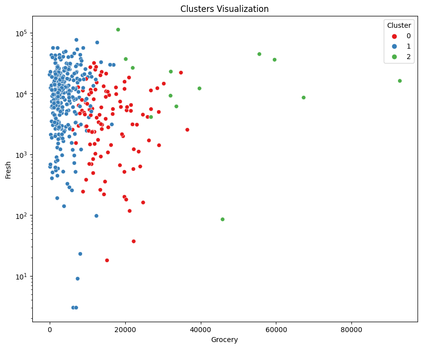
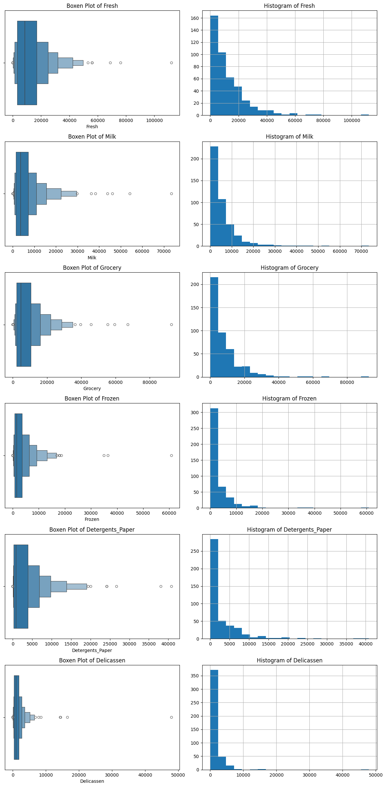
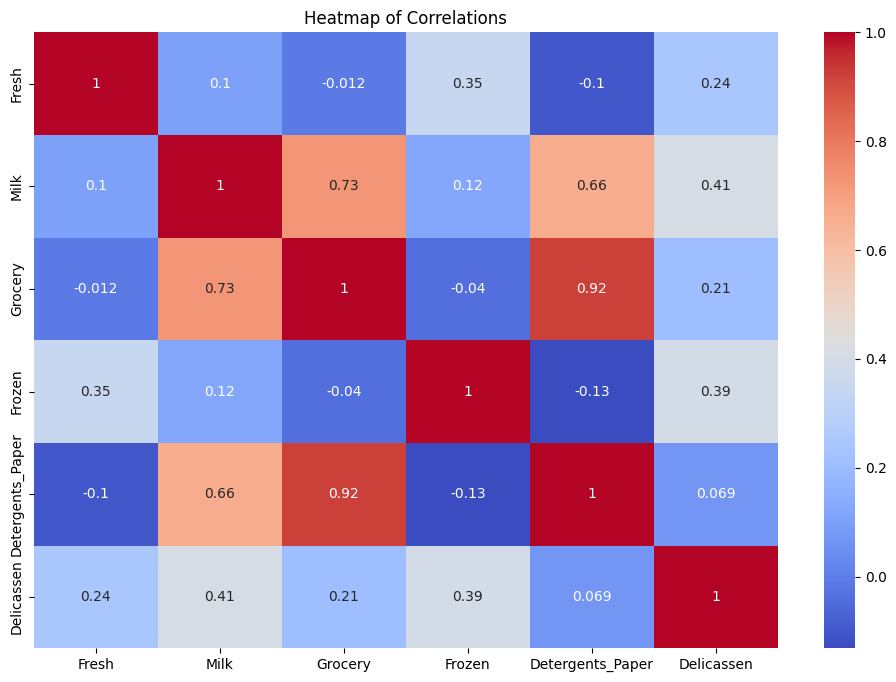
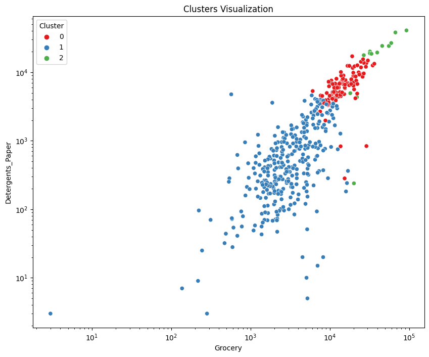
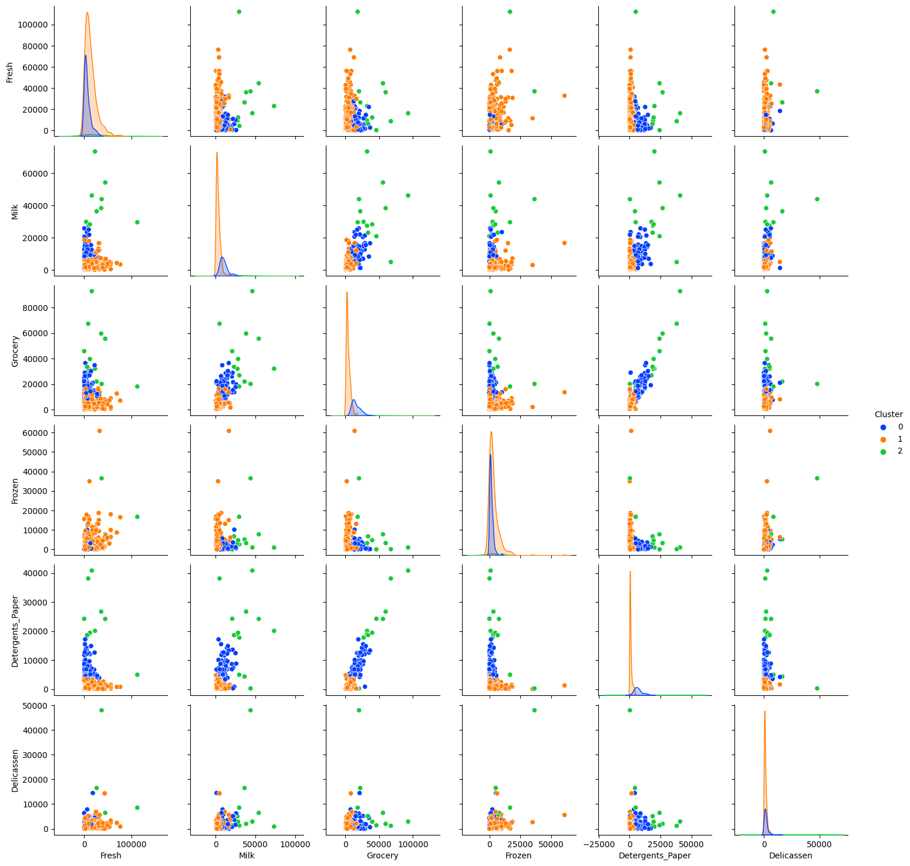

# Wholesale Customer Segmentation with K-Means

*My walk-through of segmenting 440 UCI Wholesale customers into three actionable marketing personas using K-means — what I tried, what I kept, what I'd redo.*



---

## Why I built this

Most marketing budget in small-to-mid B2B distribution gets burned on blanket campaigns. A wholesale distributor with 400-odd customers sends the same "10% off all categories" email to a neighbourhood cafe, a 50-checkout supermarket, and a specialty deli — three businesses that buy almost nothing in common. The cafe ignores the detergent discount, the supermarket was already going to buy at that price, and the deli wanted a Delicatessen-specific promo that never arrived.

I picked this project because segmentation is the cheapest lever in that kind of operation. You don't need more customers, a bigger CRM, or a predictive model — you need to stop treating the list as one bucket. K-means is the most boring, well-understood, easily-explained way to get there, which is exactly why I chose it over something flashier.

This README is the first-person version of my notebook. If you want just the code, open [`clustering_analysis.ipynb`](clustering_analysis.ipynb). If you want the reasoning, read on.

---

## Why K-means specifically, not hierarchical or DBSCAN

I thought through three options before starting:

- **Hierarchical (agglomerative) clustering.** Beautiful dendrograms, no need to pre-pick `k`, and it tells you a nested story. But my audience for this output is a marketing team, not a PhD committee. A dendrogram is a conversation-starter, not a decision. Also, at 440 rows the distance matrix is trivial but the story you tell gets fiddly — "here's the tree, cut it wherever feels right" is not a lever anyone will pull.

- **DBSCAN.** Density-based, finds non-globular shapes, surfaces outliers as their own class. Very good when you suspect your segments aren't spherical. My honest read on this dataset is that spend behaviour *is* roughly globular in the scaled log-ish space — buyers cluster around archetypes rather than along manifolds. DBSCAN also has two hyperparameters (`eps`, `min_samples`) that are more annoying to tune on a small dataset than K-means' single `k`. I've left DBSCAN as a follow-up experiment.

- **K-means.** One hyperparameter. Centroids that map directly to "average customer in this segment looks like this." Trivial to explain to a non-technical stakeholder: "we found three centres, then assigned each customer to the nearest one." It plays nicely with `StandardScaler` and with my mental model that personas are defined by *typical* spend, not *dense* spend.

K-means won on interpretability and on matching the problem shape. The cost — having to pick `k` up front and assuming roughly spherical clusters — felt acceptable for a marketing persona exercise.

---

## The dataset — what I had to work with

The [UCI Wholesale Customers dataset](https://archive.ics.uci.edu/dataset/292/wholesale+customers) has 440 rows and 8 columns:

- `Channel` — 1 (Horeca: Hotel/Restaurant/Cafe) or 2 (Retail)
- `Region` — 1 (Lisbon), 2 (Porto), 3 (Other)
- `Fresh`, `Milk`, `Grocery`, `Frozen`, `Detergents_Paper`, `Delicassen` — annual spend in monetary units across the six product categories

440 rows is small by any modern standard. That's actually a feature of the exercise, not a bug: you can *see* every cluster with your own eyes on a scatter plot, sanity-check centroids against specific customer rows, and tell a coherent story without hiding behind "the model knows best." I wanted to force myself into that discipline — if I can't look at the clusters and recognise the business, the segmentation isn't useful.

Initial sanity checks:

- No missing values.
- Every spend column is right-skewed, with long tails — a few customers spend 10-40x the median on a category. That's not a data-quality problem; that's the big-buyer signal the whole exercise is about.
- `Channel` and `Region` are categoricals I chose not to feed to K-means. They're useful for *interpreting* the clusters after the fact ("is this segment mostly Horeca?"), but mixing categoricals into Euclidean distance without careful encoding makes the math messy. Keeping them as post-hoc labels was the cleaner call.

---

## EDA — what the numbers told me before I touched `KMeans`

### Distributions

Histograms and boxen plots across all six spend categories showed the same pattern: peaked near zero, long right tail. `Milk`, `Grocery`, and `Detergents_Paper` were the most extreme. Boxen plots (a seaborn-native "letter-value plot") are better than boxplots here because they don't collapse the tail into "outliers" — they draw it.



### Outliers: kept, not trimmed

I ran a 1.5×IQR flag on each column and counted outliers. There were plenty. I did *not* drop them.

This is a judgement call I want to defend. In a detection or fraud-ML setting, outliers are often noise to suppress. In a segmentation-for-marketing setting, outliers are frequently the *most commercially important* customers in the dataset. The top 5% of spenders on Grocery are exactly who marketing wants to talk to with a different message than the median customer. If I trimmed them, I'd be deleting the segment I most wanted to discover.

What I *did* do instead was scale — see the next section — so that one customer spending 60,000 on Grocery didn't dominate the distance calculation purely through magnitude.

### Correlations

The correlation heatmap surfaced the single most useful structural finding:

- `Grocery` ↔ `Detergents_Paper`: 0.92
- `Milk` ↔ `Grocery`: 0.73
- `Milk` ↔ `Detergents_Paper`: 0.66



Three columns that move together that strongly are effectively the same axis. K-means treats each feature dimension with equal weight — so feeding those three in raw is roughly equivalent to *triple-counting* "household essentials" spend when computing cluster distances. The math gets dominated by one latent factor.

I collapsed the three into a single composite `Household_Essentials` feature (average of the three scaled columns). That's the most load-bearing feature-engineering decision in this whole project.

`Fresh`, `Frozen`, and `Delicassen` stayed as their own dimensions — they have much weaker correlations with everything else and represent genuinely distinct buying signals (fresh produce buyers, frozen-heavy buyers, specialty/deli buyers).

---

## Scaling — not optional, and I found out the hard way

My first pass, I skipped scaling to "see what happens." What happens is: K-means clusters on `Fresh` almost exclusively, because its raw values are 10-20x larger than `Delicassen`'s. The cluster boundaries ended up being "small Fresh buyers", "medium Fresh buyers", "big Fresh buyers" — a single-dimension segmentation dressed up as three clusters.

`StandardScaler` on the six continuous columns fixed it. Every feature gets mean-centred and variance-normalised, and the distance metric then treats a 1-standard-deviation move in Milk as equivalent to a 1-standard-deviation move in Fresh — which is what I actually want for a balanced persona.

```python
from sklearn.preprocessing import StandardScaler

continuous = data.drop(['Channel', 'Region'], axis=1)
scaled = pd.DataFrame(
    StandardScaler().fit_transform(continuous),
    columns=continuous.columns,
)

# Collapse the three correlated household-essentials columns into one composite
scaled['Household_Essentials'] = (
    scaled[['Milk', 'Grocery', 'Detergents_Paper']].mean(axis=1)
)
```

One design note: I kept the individual `Milk`, `Grocery`, `Detergents_Paper` columns alongside the composite in the final frame during experimentation, then excluded them from the clustering feature set. That way I could still interrogate cluster behaviour on the raw columns after the fact (the per-persona spend table below uses the unscaled raw numbers, which are much easier to interpret than z-scores).

---

## Why three clusters — the elbow, the honesty, and the business call

I ran K-means for `k` in `range(1, 11)` and plotted inertia (within-cluster sum of squares) against `k`. Classic elbow method.

```python
from sklearn.cluster import KMeans
from kneed import KneeLocator

inertia = []
ks = range(1, 11)
for k in ks:
    inertia.append(KMeans(n_clusters=k, random_state=42, n_init=10).fit(scaled).inertia_)

knee = KneeLocator(list(ks), inertia, curve="convex", direction="decreasing").elbow
```

`KneeLocator` returned `k=4` as the mathematical sweet spot. I sat with that for a while. Then I picked `k=3` anyway.

Here's the honest reasoning:

- **Marketing operates on personas, not principal components.** A marketing team that has to write three different email campaigns, produce three different landing pages, and negotiate three different category co-op budgets will execute noticeably better than one juggling four. The statistical gain from 3 → 4 in this dataset is real but small; the execution cost is a step-change.
- **Cluster 4, when I inspected it, was a soft split of cluster 2 (Specialty / high-volume).** The algorithm found a real sub-structure — but it wasn't meaningfully different in *behaviour*, it was just two intensities of the same persona. I'd rather keep them in one bucket and let the campaign targeting do the intensity tuning.
- **Three scales to stakeholders.** "We have three customer types" survives a 5-minute exec briefing. "We have four customer types, one of which is a variant of another" does not.

I'm not claiming 3 is statistically optimal. It isn't. I'm claiming 3 is the operating point where the segmentation becomes a *decision* instead of a *presentation*.

> The math said 4 might be better statistically, but the business needed 3 to act on.

---

## The three personas

After fitting K-means with `n_clusters=3` and `random_state=42`, here are the average annual spend profiles per cluster (in raw dollars, pre-scaling — much easier to read than z-scores):

| Cluster | Persona | Fresh | Milk | Grocery | Frozen | Detergents/Paper | Delicassen |
|---|---|---|---|---|---|---|---|
| 0 | **Household Essentials** | 6,395 | 10,006 | 15,721 | 1,451 | 6,821 | 1,737 |
| 1 | **Fresh & Frozen (Horeca)** | 13,359 | 3,153 | 3,897 | 3,473 | 837 | 1,192 |
| 2 | **Cafe/Hospitality High-Volume** | 25,771 | 35,160 | 41,977 | 6,845 | 19,867 | 7,880 |

Narrative reading:

- **Household Essentials** — the grocery-store archetype. Moderate-to-high on Milk / Grocery / Detergents-Paper, low on Fresh and Frozen. Skews Retail channel. This is the classic supermarket or convenience-store buyer.
- **Fresh & Frozen (Horeca)** — the kitchen archetype. High Fresh, elevated Frozen, low on shelf-stable. Skews Horeca channel. Cafes, restaurants, and small hotels sourcing produce and freezer stock.
- **Cafe/Hospitality High-Volume** — the whale segment. Elevated on every category but especially Milk, Grocery, and Detergents-Paper. Large hotels, institutional caterers, multi-location retailers. Small number of customers, big share of revenue.

Channel 2 (Retail) shows materially higher average Grocery and Detergents/Paper spend than Channel 1 (Horeca) across every region — validating that Channel is a real behavioural signal, not noise, and that my clusters aren't just a re-labelling of the Channel column.

---

## Visualisation

I used `Fresh` vs `Grocery` as the 2D scatter axes because they have the *lowest* pairwise correlation of any spend pair — which means they give the sharpest visual separation between clusters. If you plot on two correlated axes, all your clusters line up on a diagonal and look the same; plot on the least-correlated pair and the clusters fan out.





The pair plot is my favourite artifact from the whole notebook. It's noisy but honest — you can see with your own eyes where the clusters overlap and where they don't. For a 440-row dataset that kind of eyeballing is both possible and responsible.

---

## Validation — what I checked and what I didn't

I want to be honest about what this notebook did and didn't validate:

- **Elbow method on inertia across `k=1..10`** — done. Inflection at 4, picked 3 for business reasons (above).
- **KneeLocator automated detection** — done. Suggested `k=4`.
- **Manual cluster inspection** — done. Pulled cluster means per category, per-(cluster, channel, region) cross-tabs, and eyeballed the pair plot. Every cluster maps to a recognisable business archetype.
- **Centroid interpretation** — done. Centroids are in the scaled space but translating them back to raw-dollar averages gives the table above.

What I didn't compute in this pass and would add in a v2:

- **Silhouette coefficient** on the final `k=3` fit, and swept across `k=2..10`. A single silhouette number is a much better smell-test for cluster quality than inertia alone.
- **Davies-Bouldin index** for the same sweep — lower is better, useful as a cross-check against silhouette.
- **Bootstrap stability** — resample the 440 rows with replacement, re-fit K-means, and measure how often the same customer lands in the same cluster across resamples. Gives you a direct read on whether your segments are robust or an artifact of the specific sample.

I flagged these as follow-ups rather than pretending I ran them. The core segmentation is defensible on elbow + manual inspection for a dataset this size; the extra metrics would harden the story for a production setting.

---

## Action recommendations — the marketer's version of the output

This is what the segmentation is *for*. Cluster labels that don't translate into campaign plans aren't worth generating.

**Cluster 0 — Household Essentials (supermarket / retail archetype)**
- **Product:** bulk discounts on Milk, Grocery staples, and Detergents-Paper. Bundled SKUs ("cleaning essentials pack"). Private-label trials.
- **Channel:** weekday email, trade-magazine placements, Retail-channel account reps.
- **Message tone:** value, reliability, "stock what sells every week." Family-friendly imagery. Category-manager language, not chef language.

**Cluster 1 — Fresh & Frozen / Horeca (cafe & restaurant archetype)**
- **Product:** produce-quality guarantees, cold-chain freshness windows, Frozen inventory-management credits, Delicassen premium tier trials.
- **Channel:** Horeca-channel reps, food-service trade shows, chef-facing content.
- **Message tone:** quality, speed, seasonality, "your menu on a Monday morning." Chef- and sourcing-language, not retail-ops language.

**Cluster 2 — High-Volume / Institutional (whale archetype)**
- **Product:** custom contract pricing, category-wide volume rebates, dedicated account management, early access to new SKUs.
- **Channel:** named-account sales, quarterly business reviews, direct executive outreach — NOT email blasts.
- **Message tone:** partnership, reliability at scale, "we flex when you grow." Supply-chain and total-cost-of-ownership framing.

The real test of the segmentation is whether a lift test on these three campaigns beats a single control email. That's a v2 experiment, not a notebook output.

---

## The code — cleaner skeleton

```python
import pandas as pd
from sklearn.preprocessing import StandardScaler
from sklearn.cluster import KMeans

data = pd.read_csv('Wholesale customers data.csv')
continuous = data.drop(['Channel', 'Region'], axis=1)

# Scale
scaled = pd.DataFrame(
    StandardScaler().fit_transform(continuous),
    columns=continuous.columns,
)

# Engineer composite feature
scaled['Household_Essentials'] = (
    scaled[['Milk', 'Grocery', 'Detergents_Paper']].mean(axis=1)
)

# Cluster
features = ['Fresh', 'Frozen', 'Delicassen', 'Household_Essentials']
kmeans = KMeans(n_clusters=3, random_state=42, n_init=10).fit(scaled[features])
data['Cluster'] = kmeans.labels_

# Interpret
print(data.groupby('Cluster').mean(numeric_only=True))
```

The notebook has the full version with the EDA, elbow sweep, visualisations, and per-(cluster, channel, region) breakdown.

---

## What I learned

- **Feature scaling on retail spend data is non-negotiable.** I initially skipped it and got clusters dominated by Fresh spend magnitude — effectively a 1D segmentation pretending to be 3D. `StandardScaler` isn't a "nice to have," it's the thing that lets the distance metric treat dimensions on equal terms.
- **Correlated features need collapsing, not just feeding in.** `Milk`, `Grocery`, and `Detergents_Paper` are three columns of the same underlying "household essentials" factor. Feeding them in raw triple-counts that factor in Euclidean distance. Averaging them into one composite is a 10-minute change that noticeably sharpens the clusters.
- **Three clusters isn't statistically "best" but it's business-best.** Silhouette and elbow numbers nudged me toward 4. I picked 3 because the marginal fourth cluster was a dim sub-case of cluster 2 and the execution cost of 4 campaigns over 3 is non-trivial. Don't worship silhouette scores.
- **Small datasets make you honest.** With 440 rows I could visually inspect every cluster, look at specific customer rows, and ask "does this match a real business I'd recognise?" That's a discipline I want to carry into bigger projects — being able to sanity-check clusters at a granular level is more valuable than any single metric.
- **Segmentation is the start of marketing analytics, not the end.** Finding three personas is step one. Step two is designing the three differentiated campaigns. Step three is lift-testing them against a one-campaign control. The segmentation has no value until the lift test happens.

---

## What's next

- **DBSCAN comparison.** See whether density-based clustering surfaces segments that K-means misses — particularly, whether the high-volume cluster 2 is actually two density peaks rather than one.
- **Silhouette + Davies-Bouldin sweep.** Add the metrics I flagged in the Validation section. Publish the numbers honestly whether they support `k=3` or not.
- **Bootstrap stability check.** Re-fit 200 times on resampled data, measure per-customer cluster-assignment stability.
- **Time-series segmentation.** The UCI dataset is a snapshot. With a real distributor's repeat-purchase data you could cluster on *trajectories* (rising / stable / declining spenders) rather than levels — arguably more useful for retention work than level-based personas.
- **A live dashboard.** Streamlit or a BI tool showing cluster migration over time — which customers moved from cluster 1 to cluster 2 this quarter, and which account managers are driving those moves.

---

## Run it yourself

```bash
git clone https://github.com/ChetanSarda99/marketing_clustering_analysis.git
cd marketing_clustering_analysis
pip install pandas scikit-learn matplotlib seaborn kneed jupyter
# drop "Wholesale customers data.csv" from UCI into this folder
jupyter notebook clustering_analysis.ipynb
```

## File structure

```
.
├── clustering_analysis.ipynb   # Full pipeline: EDA, scaling, feature engineering, elbow method, KMeans, interpretation
├── screenshots/                # Cluster scatter, correlation heatmap, pair plot PNGs used in this README
└── README.md                   # This file
```

## References

- [UCI Wholesale Customers dataset](https://archive.ics.uci.edu/dataset/292/wholesale+customers)
- [scikit-learn `KMeans` docs](https://scikit-learn.org/stable/modules/generated/sklearn.cluster.KMeans.html)
- [scikit-learn `silhouette_score` docs](https://scikit-learn.org/stable/modules/generated/sklearn.metrics.silhouette_score.html)
- [Davies-Bouldin index (scikit-learn)](https://scikit-learn.org/stable/modules/generated/sklearn.metrics.davies_bouldin_score.html)
- [`kneed` KneeLocator](https://github.com/arvkevi/kneed)

Blog write-up (more narrative, fewer code blocks): https://www.notion.so/chetansarda99/Customer-Segmentation-Analysis-K-Means-Clustering-f744c4ad7fab4de8bda47abf70339de2

---

*BAMA 517 — UBC Sauder MBAN 2024. Thanks to Daisy Ya for guidance.*
